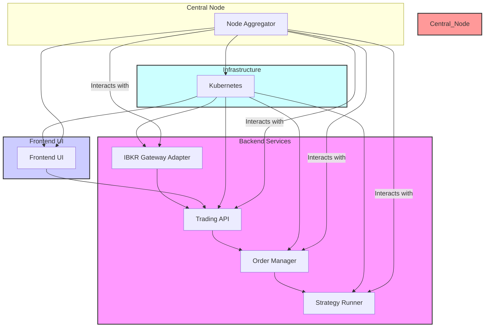

# General

```mermaid
graph TB
    subgraph Backend [Backend Services]
        A1[IBKR Gateway Adapter] --> B1[Trading API]
        B1 --> C1[Order Manager]
        C1 --> D1[Strategy Runner]
    end

    subgraph Frontend [Frontend UI]
        E1[Frontend UI] --> B1
    end

    subgraph Infrastructure [Infrastructure]
        F1[Kubernetes] --> A1
        F1 --> B1
        F1 --> C1
        F1 --> D1
    end

    F1 --> E1

    subgraph Central Node [Central Node]
        G1[Node Aggregator] --> F1
        G1 --> E1
    end

    G1 -->|Interacts with| A1
    G1 -->|Interacts with| B1
    G1 -->|Interacts with| C1
    G1 -->|Interacts with| D1

    style Backend fill:#f9f,stroke:#333,stroke-width:2px
    style Frontend fill:#ccf,stroke:#333,stroke-width:2px
    style Infrastructure fill:#cff,stroke:#333,stroke-width:2px
    style Central_Node fill:#f99,stroke:#333,stroke-width:2px

```

