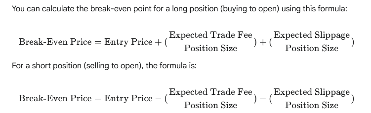

# Trade Fee

A trade fee is a commission or charge that a broker or exchange levies on a trader for executing a buy or sell order. This fee is a cost of trading and can be structured in a number of ways, such as:

  * **Flat Fee**: A fixed amount per trade, regardless of the size.
  * **Percentage-Based**: A percentage of the total value of the trade.
  * **Tiered**: Fees that decrease as a trader's volume increases.

# Slippage

Slippage is the difference between the expected price of a trade and the price at which the trade is actually executed. It often occurs in fast-moving or volatile markets, where the price of a security can change between the time an order is placed and the time it is filled. Slippage is a risk factor, as it can result in a less favorable price for the trader than they initially anticipated. It is typically measured in pips, which are the smallest unit of price movement for a given security.

# Usage

Based on your trading logic flow, you should calculate the "break even" point for each potential trade. This value is essential for making informed decisions before placing an order.

## Break-Even Calculation
The break-even price is the price at which a trade's total revenue equals its total cost. The key components of this calculation are the entry price, the expected trade fee, and the expected slippage.

You can calculate the break-even point for a long position (buying to open) using this formula:
$$\text{Break-Even Price} = \text{Entry Price} + (\frac{\text{Expected Trade Fee}}{\text{Position Size}}) + (\frac{\text{Expected Slippage}}{\text{Position Size}})$$

For a short position (selling to open), the formula is:
$$\text{Break-Even Price} = \text{Entry Price} - (\frac{\text{Expected Trade Fee}}{\text{Position Size}}) - (\frac{\text{Expected Slippage}}{\text{Position Size}})$$

Your logic for dynamically changing these values during a trade is also a solid practice. Here's how you can model that in your system:

***

### Dynamic Fee and Slippage Management
You can manage dynamic fees and slippage by storing them as parameters of your trading strategy. This allows your strategy to adapt to real-time market conditions and broker policies.

* **Strategy Parameters**: You can store a `trade_fee_model` and a `slippage_model` in your strategy's configuration. These models would be functions or classes that calculate the expected fee and slippage based on factors like trade size, volatility, and time of day.
* **Real-time Updates**: Your `run` method in the strategy can update the `trade_fee` and `slippage` variables on each tick. This will allow your `break-even` calculation to be highly responsive to market changes.
* **Data Access Layer**: Your `data_accessor` can then use these updated values to store a realistic `PnL` in the `trade_session` table, ensuring your backtest results are accurate and reflect the true costs of trading.